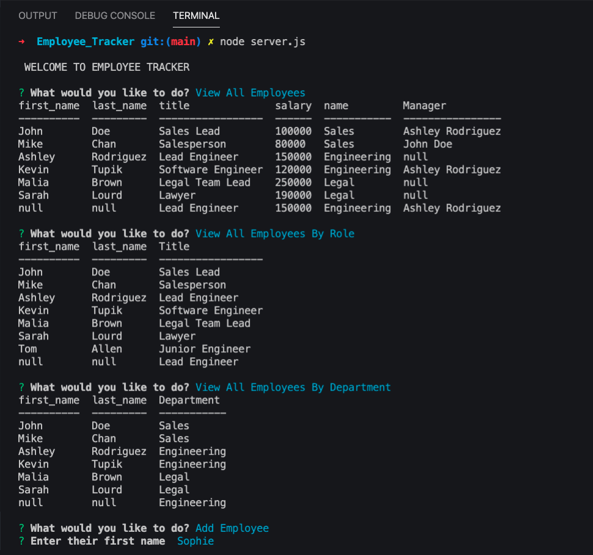

# Employee_Tracker


[](http://https://github.com/SIROG-E)

## Description

This Node application is for a business owner to be able to view and manage departments, roles, and employees in their company in order to organize and plan their business.

The application gives yout the following options:


* View all employees with the option by role, or department.
* Add an employee, role, or department.
* Update an employee.


## Table of Contents

- [Description](#description)
- [Installation](#installation)
- [Usage](#usage)
- [Preview](#preview)
- [Website](#website)
- [License](#license)
- [Contributing](#contributing)
- [Test](#tests)
- [Questions](#questions)

## Installation

`Run:`

```
npm install
```

`Run in MySQL Workbench:`

```
schema.sql  
```

## Usage

`Run:`


```
node server.js
```

## Preview




### Websites

[Employee_Tracker](https://github.com/SIROG-E/Employee_Tracker)

## License

This project is licensed by:
[](https://opensource.org/licenses/MIT)

## Contributing


## Test


## Questions

If you have any questions, contact SIROG-E at goris.evelyn@gmail.com

## Repository

- [Project Repo](https://github.com/SIROG-E/Employee_Tracker)

## GitHub


- Evelyn Goris
- [GitHub Profile](https://github.com/SIROG-E)
- <goris.evelyn@gmail.com>
